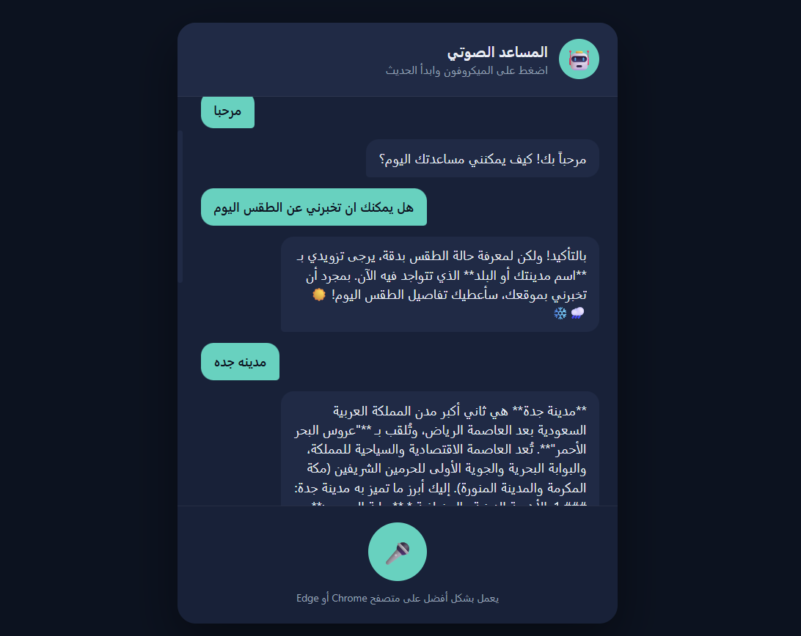

# 🎙️ Arabic Voice AI ChatBot (Gemini API)

This repository hosts the backend and interface logic for a web-based Arabic voice assistant. It handles server-side request processing, communicates securely with the Google Gemini AI engine, and powers the browser interface.

---

## 💻 Tech Stack

* **PHP 8.1+ & cURL** — Manages secure server-side proxy operations.
* **Google Gemini API** — Drives the core AI model for response generation (used as the LLM engine).
* **Vanilla JavaScript** — Utilizes native browser Web Speech APIs for handling speech-to-text and text-to-speech.
* **HTML5 & CSS3** — Builds a clean, responsive dark-themed user interface.
* **InfinityFree** — Deployed on lightweight PHP-compatible web hosting.

---

## 🖼️ Interface Preview

---

## 🌍 Live Website

[Try the Voice Chatbot Live](https://sumey.free.je/pro/)

---

## ⭐ Key Capabilities

* **Secure Proxy Layer:** Keeps the Gemini API key hidden on the server, avoiding browser exposure.
* **Native Speech Integration:** Directly leverages browser audio tools without heavy external frameworks.
* **Robust Diagnostics:** Includes built-in error handling and detailed exception reporting for easy troubleshooting.
* **Zero Node.js Dependency:** Designed to run smoothly on standard, free PHP hosting environments.
